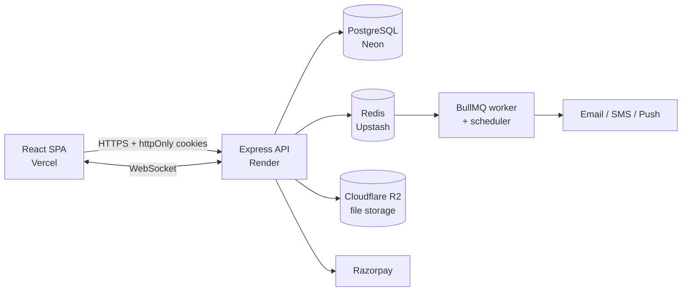
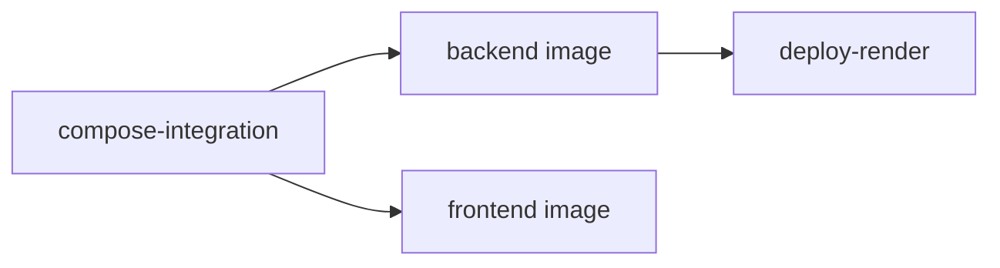

# RoleGuard

Role-based access control and team workspace platform. Users authenticate, create or join workspaces, manage member roles, and collaborate through real-time messaging, announcements, and notifications delivered over in-app, email, SMS, and browser push channels.

| Environment | URL |
|---|---|
| API (Render) | https://role-guard-authentication-system.onrender.com |
| Frontend | Deployed on Vercel from `main` |

---

## Architecture



The API and the background worker run in the same Node process. PostgreSQL is the system of record; Redis holds only in-flight queue state and can be lost without data loss (see [`backend/BACKUP.md`](backend/BACKUP.md)).

## Stack

| Layer | Technology |
|---|---|
| Runtime | Node.js 22, TypeScript |
| API | Express, Zod validation, Winston logging |
| Real-time | Socket.IO |
| Jobs | BullMQ on Redis, node-cron |
| Data | PostgreSQL (`pg`), Redis (`ioredis`) |
| Auth | JWT access/refresh tokens in httpOnly cookies, bcrypt, Google OAuth |
| Frontend | React, Vite, Redux Toolkit, React Router, Axios |
| Integrations | Razorpay, Twilio, Nodemailer, web-push (VAPID), Cloudflare R2, pdfkit |
| Infrastructure | Docker, GitHub Actions, GHCR, Render, Vercel |

## Getting Started

### Prerequisites
- Docker with Compose v2
- Node.js 22 (only needed to run services outside Docker)

### Run the full stack

```bash
cp backend/.env.production.example backend/.env
# edit backend/.env: at minimum set JWT secrets and VAPID keys (see Configuration)

docker compose up -d --build
```

| Service | Address |
|---|---|
| Frontend | http://localhost |
| API | http://localhost:3000 |
| PostgreSQL | localhost:5432 |
| Redis | localhost:6379 |

On first start, Postgres applies `backend/database.sql` automatically. The schema is idempotent (`IF NOT EXISTS` throughout), so it is also safe to re-run manually against an existing database.

> **Docker Desktop (Windows/macOS):** port forwarding can lag a few seconds behind container health status after a rebuild. If the first requests fail with `ECONNREFUSED`, wait for `curl -f http://localhost:3000/health/live` to succeed before opening the browser.

### Run services individually

```bash
# backend — hot reload via nodemon + ts-node
cd backend && npm ci && npm run dev

# frontend — Vite dev server
cd frontend && npm ci && npm run dev
```

Both still require Postgres and Redis to be reachable.

## Configuration

Full reference: [`backend/.env.production.example`](backend/.env.production.example) and [`frontend/.env.production.example`](frontend/.env.production.example).

In production the backend validates required variables at boot and exits immediately if any are missing, rather than starting in a degraded state.

| Group | Variables | Notes |
|---|---|---|
| Core | `NODE_ENV`, `PORT`, `LOG_LEVEL`, `CORS_ORIGIN`, `FRONTEND_URL` | |
| Database | `DB_HOST`, `DB_PORT`, `DB_NAME`, `DB_USER`, `DB_PASSWORD` | Required in production |
| Redis | `REDIS_HOST`, `REDIS_PORT`, `REDIS_PASSWORD`, `REDIS_TLS` | Set `REDIS_TLS=true` for providers that require TLS (e.g. Upstash) |
| Auth | `JWT_SECRET`, `JWT_REFRESH_SECRET`, `JWT_EXPIRY`, `JWT_REFRESH_EXPIRY` | Use distinct, randomly generated values (`openssl rand -hex 48`) |
| Push | `VAPID_PUBLIC_KEY`, `VAPID_PRIVATE_KEY`, `VAPID_SUBJECT` | Required at startup. Generate with `npx web-push generate-vapid-keys` |
| Email | `SMTP_HOST`, `SMTP_PORT`, `SMTP_USER`, `SMTP_PASS`, `SMTP_FROM` | |
| SMS | `TWILIO_ACCOUNT_SID`, `TWILIO_AUTH_TOKEN`, `TWILIO_FROM_NUMBER` | |
| Storage | `R2_ACCOUNT_ID`, `R2_ACCESS_KEY_ID`, `R2_SECRET_ACCESS_KEY`, `R2_BUCKET_NAME`, `R2_PUBLIC_URL` | |
| Payments | `RAZORPAY_KEY_ID`, `RAZORPAY_KEY_SECRET`, `RAZORPAY_WEBHOOK_SECRET` | |
| OAuth | `GOOGLE_CLIENT_ID`, `GOOGLE_CLIENT_SECRET`, `GOOGLE_REDIRECT_URI` | |
| Backups | `RETENTION_DAYS` | Default 14 |
| Frontend (build-time) | `VITE_API_URL`, `VITE_RAZORPAY_KEY_ID` | Baked into the bundle at build time |

Never commit `.env` files. Both are gitignored.

## API Surface

| Prefix | Purpose |
|---|---|
| `/api/auth` | Registration, login, OTP verification, token refresh, logout |
| `/api/auth/oauth` | Google OAuth flow |
| `/api/profile` | User profile management |
| `/api/workspaces` | Workspaces, members, invites, workspace messaging |
| `/api/announcements` | Workspace announcements |
| `/api/notifications` | Notification feed and unread counts |
| `/api/notification-preferences` | Per-channel delivery preferences |
| `/api/notification-mute` | Muting rules |
| `/api/push-subscriptions` | Browser push registration |
| `/api/dashboard` | Analytics and PDF report export |
| `/api/queue` | Background job inspection and control |
| `/api/service-status` | External integration status |
| `/api/upload` | File uploads to R2 |
| `/api/payments` | Razorpay orders and webhooks |

### Health checks

| Endpoint | Checks | Use for |
|---|---|---|
| `GET /health/live` | Process is serving HTTP | Container liveness |
| `GET /health/ready` | PostgreSQL and Redis reachable | Readiness and deploy verification |

## Security

- Access and refresh tokens are issued only as httpOnly cookies and never returned in response bodies. Refresh tokens are scoped to the refresh endpoint path.
- Refresh tokens are signature-, expiry-, and issuer-verified before new access tokens are issued.
- Cookies use `SameSite=None; Secure` in production (cross-site Vercel frontend to Render API) and `SameSite=Strict` in development.
- Request payloads are validated with Zod schemas.
- Per-IP rate limits on credential endpoints: login (5 / 15 min), registration (3 / hour), OTP verification (8 / 15 min).
- The production container runs as a non-root user.

## CI/CD

Every push to `main` runs two workflows.

**CI** (`.github/workflows/ci.yml`): dependency install, type-check, lint, and a Docker build smoke test per service. Also runs on pull requests.

**CD** (`.github/workflows/cd.yml`):



1. **compose-integration** boots the complete Compose stack on the runner and waits for `/health/ready` and the frontend to respond. A misconfigured service, broken schema, or missing startup dependency fails the pipeline before anything is published.
2. **backend / frontend** build and push images to GHCR, tagged by branch, semver tag, and commit SHA.
3. **deploy-render** triggers the Render deploy hook, then polls production until it responds or times out.

Frontend deploys to Vercel through its native GitHub integration.

### Required repository secrets

| Secret / Variable | Used by |
|---|---|
| `RENDER_DEPLOY_HOOK_URL` (secret) | `deploy-render` |
| `VITE_RAZORPAY_KEY_ID` (secret) | frontend image build |
| `VITE_API_URL` (variable) | frontend image build |

## Operations

- **Logs:** structured JSON via Winston, including per-request method, path, status, and latency.
- **Backups:** PostgreSQL only. Strategy, schedule, and restore procedure are documented in [`backend/BACKUP.md`](backend/BACKUP.md).
- **Schema changes:** apply `backend/database.sql` to the target database. Statements are idempotent.

## Project Structure

```
.
├── backend/
│   ├── src/
│   │   ├── config/        # env validation, db, redis, socket, logger, health
│   │   ├── controllers/
│   │   ├── routes/
│   │   ├── services/      # domain logic, integrations, queue worker, scheduler
│   │   ├── middleware/    # auth, rate limiting, validation
│   │   ├── validations/   # Zod schemas
│   │   └── index.ts
│   ├── database.sql
│   ├── BACKUP.md
│   └── Dockerfile
├── frontend/
│   ├── src/
│   │   ├── pages/
│   │   ├── components/
│   │   ├── store/         # Redux slices
│   │   └── services/      # API and socket clients
│   ├── nginx.conf
│   └── Dockerfile
├── .github/workflows/     # ci.yml, cd.yml
└── docker-compose.yml
```
